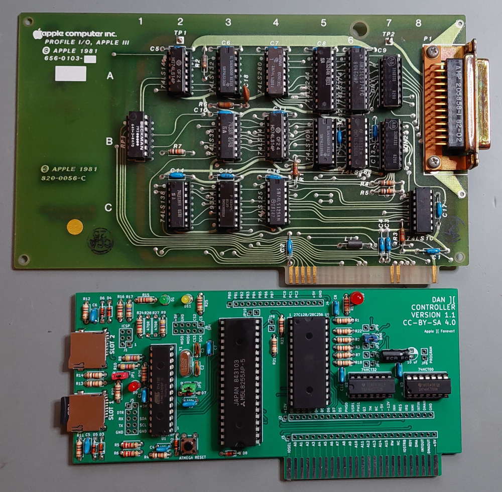
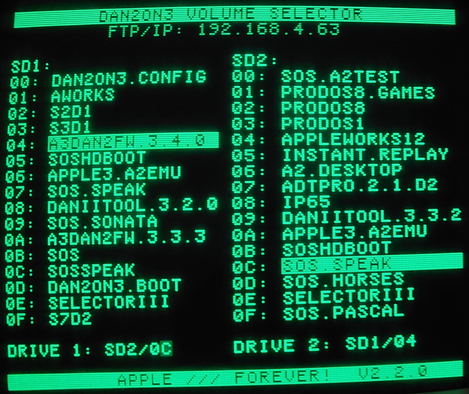
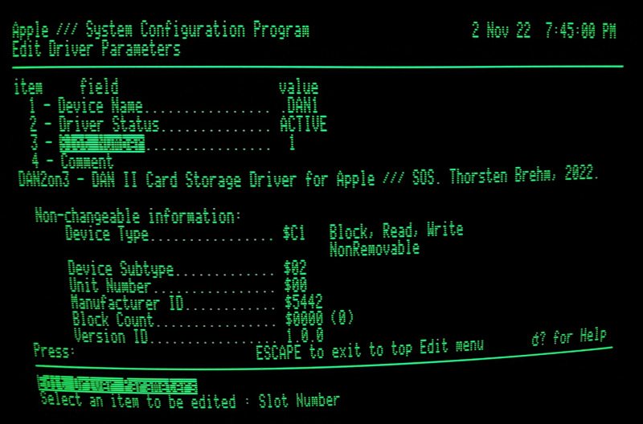
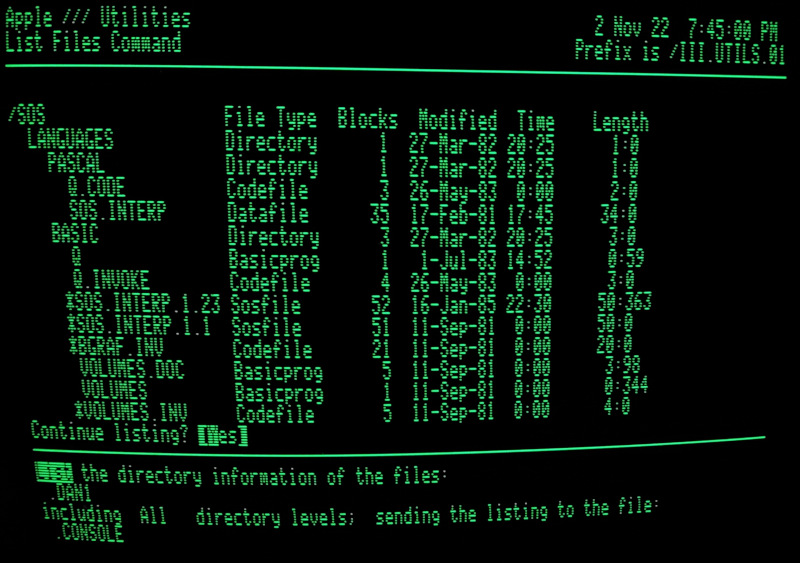

# DAN2on3: DAN II Controller Driver for Apple /// SOS

The [DANII Controller Card](https://github.com/profdc9/Apple2Card) is a simple, easy to build SD controller card using easily available components for the Apple II.

The Apple /// shares the same I/O slots as the Apple II family (even if the Apple /// only has 4 slots) but supports I/O cards to have a slightly larger physical dimension. However, while the DAN II controller fits nicely into the Apple /// slots, the Apple /// does not support the card's ROM boot menu. Also, a driver is required for the Apple /// SOS operating system.

This projects provides an Apple /// SOS driver for the DAN II controller card: the DAN2on3 driver.
Additionally, a separate configuration disk is provided to configure the DAN II controllers SD card slots, as a replacement for the boot menu - since Apple /// does not support boot ROMs. See [releases](https://github.com/ThorstenBr/DAN2on3/releases) for prebuilt driver and disks.

## DAN II Controller as Apple /// Profile Replacement ##
_Photo shows the original Apple /// Profile interface card (above) - which just provided the communication interface to the external Profile hard disk._
_Photo below is the DAN II Controller card - which includes everything - even the two SD cards as hard disk replacements)._

The DAN II controller is made to fit the slim Apple II case - so it has more than enough space in an Apple ///. Unfortunately the SD cards are facing towards the inside of the Apple ///. This layout made sense on the Apple II, where cards cannot be accessed from the outside. Indeed, for the Apple /// a different layout would haven been preferable, placing the SD cards on the other edge of the controller card. But, we'll have to live with that... :)

# Features
* DAN II Controller SOS driver providing separate volumes for each SD card. SD slots 1 and 2 are mapped to SOS drives ".DAN1" and ".DAN2"... :-)
* Faster than on the Apple II: the controller works fine at Apple ///'s full 2 MHz clock.
* Separate Apple /// disk with DAN II Controller volume configuration.
* Supports images of up to the maximum SOS volume size (16MB, 32767 * 512 bytes). Smaller images are also supported.
* Automatic detection of the DAN II Controller slot (default). Manual slot configuration also supported.
* Format support is *not* available. Please use preformatted disk images (see [volumes](/volumes) folder for templates).

# Controller Volume Configuration

## Boot ROM

Unlike the Apple ][, the stock Apple /// ROM has no support for custom extensions. The original Apple /// ROM only supported booting from a floppy, nothing else.
If you want the convenience of configuring and bootstrapping volumes from the DAN][ Controller directly, you can use a custom ROM.

The custom Apple /// ROM was moved to separate project. It has options supporting DAN][ bootstrapping, but also provides improved monitor/debug options etc. See here:

* **Apple /// Custom ROM project:** [https://github.com/ThorstenBr/Apple_III_Custom_ROM](https://github.com/ThorstenBr/Apple_III_Custom_ROM).

You may also be interested in a ROM adapter, so you can use standard (E)EPROMs (27c64 or 28c64) with your Apple ///:

* **Apple /// ROM Adapter**: [https://github.com/ThorstenBr/Apple_III_ROM_Adapter](https://github.com/ThorstenBr/Apple_III_ROM_Adapter)

The use of the custom ROM is optional though. You can also use a boot disk to configure the DAN][ Controller in the Apple ///.

## Boot Disk
With its default ROM, the Apple /// does not support the DAN II controller's ROM boot configuration menu ("DAN II PRESS RETURN" as known from the Apple II). You can manually invoke the ROM boot menu using the Apple II emulation disk on the Apple ///: load Apple II emulation disk, then enter "PR#1" in Apple BASIC to configure the controller plugged into slot 1 (PR#2 if plugged into slot #2 etc).

However, since a separate disk is required anyway, a separate configuration disk "Apple3SOS.DAN2on3.Boot.dsk" is provided for convenience. It provides the same configuration options as known from the controller's Apple II boot menu.

The boot disk automatically detects whether the DAN II controller is plugged and in which slot.
It also shows the list of available volume files present on the SD cards.

Configuration is identical/similar as known from the Apple II:

* Use the **ARROW KEYS** (or **SPACE**/**,**) to select the active volume for each SOS drive and press **RETURN** to confirm.
* Alternatively press keys **0** to **9** or **A** to **F** to directly select volumes.
* Press **LEFT**/**RIGHT ARROW** to flip the volume pages (if you have more than 16 volumes per SD card).
* Press **ESCAPE** to abort and keep the previous drive configuration.
* Press **I** to enter the IP configuration dialog (if you have the Wiznet 5500 module attached).
* See the [DANII controller documentation](https://github.com/ThorstenBr/Apple2Card) for details.

**Note:**

* The menu now supports the flexible volume mapping, which is supported by newer firmware of the DAN][ controller (firmware >= [3.0.0](https://github.com/ThorstenBr/Apple2Card/releases)). Volumes 1 + 2 may be selected from any of the 32 volumes (independently of the SD card).
* If, however, you are using a DANII controller card with earlier firmware, then you have to restrict to select volume 1 on SD card 1 and volume 2 on SD card 2 (the menu does not check your firmware version).
* Apple III SOS volume images of up to 16MB (32767 * 512 bytes) are supported. With Apple II ProDOS up to 32MB (65535 * 512 bytes) may be used, however, the larger 32MB images are not properly handled by Apple III SOS (though the file system itself is identical between Apple II ProDOS and Apple /// SOS).

# DAN2on3 SOS Driver
To make the SD slots available in *Apple /// SOS*, add the **DAN2ON3.DRIVER** to the **SOS.DRIVER** file of your Apple /// boot disk.
The "Apple3SOS.DAN2on3.Config.dsk" (with the card's configuration menu) also contains the necessary DAN2ON3.DRIVER file, which you can read using your Apple /// SOS System Utilities disk.

You can also use the separately provided "Apple3SOS.DAN2on3.SysUtils.dsk" which provides the System Utilities for SOS 1.3 - and is already preconfigured with the DAN2ON3.DRIVER.

By default, the SOS driver automatically detects the slot occupied by the DAN II controller.
You can also use manual configuration, however, as this was usual for Apple /// drivers.

If you wish to manually configure the slot:
* Enter the *System Configuration Program* (SCP).
* Load your *SOS.DRIVER* file.
* Read and add the **DAN2ON3.DRIVER** from the configuration disk.
* Select "*Edit Driver Parameters*" and select the "**.DAN1**" (or "**.DAN2**") device.
* Change "*Slot Number*" as required. Slot auto-detection is enabled by default - and "??" is shown instead of a specific slot number.
* Finally select "*Generate New System*" and write the new configuration to your boot disk.

## Caveats
*Auto-detection not working*: The driver does support slot auto-detection of the DAN II Controller, however, this may not work if your SOS.DRIVER file contains another driver which is configured to occupy a specific slot.
If, for example, your configuration contains a .PROFILE or .RAM driver configured to slot 3, you removed the respective card from its slot, and plugged your DAN II Controller in this same slot instead, then SOS will fail to load the DAN2ON3 driver.
SOS blocks the request of a driver, when the requested slot is already allocated to another driver - even if the other hardware isn't present. You will need to disable the conflicting driver (set it to "INACTIVE"), change its slot, or remove the conflicting driver entirely from your SOS.DRIVER configuration.

# Usage
Once the driver is installed in your Apple ///'s SOS.DRIVER, you have two new drives:
* **.DAN1** for the first configured DAN][ volume
* **.DAN2** for the second configured DAN][ volume

These volumes otherwise work as any other volume. The names *.DAN1*, *.DAN2* are only defaults. Some Apple /// programs, such as *Selector III*, only accept devices with the original Apple /// hard disk name **.PROFILE**. You can rename the default device names of the driver if necessary. Use the *System Configuration Program (SCP)* to rename *.DAN1* to *.PROFILE*, for example.

Support for formatting is currently not enabled. For now, you have to use preformatted volume images.

# Building
* Uses standard GNU makefiles usable for Linux and Windows WSL environment. Just run "make" in the root folder to build.
* A Python3 interpreter is required.
* The [ca65](https://github.com/cc65/cc65) 6502 assembler from  Ullrich von Bassewitz is required.
* The [AppleCommander](https://github.com/AppleCommander/AppleCommander) utility to build disks is included - but requires the installation of a Java Runtime Environment.
* A utility ([A3Driverutil](https://github.com/robjustice/a3driverutil)) by Robert Justice to manipulate Apple /// SOS.DRIVER files is included.

A prebuilt driver and disks in various formats are available. See [releases](https://github.com/ThorstenBr/DAN2on3/releases).
